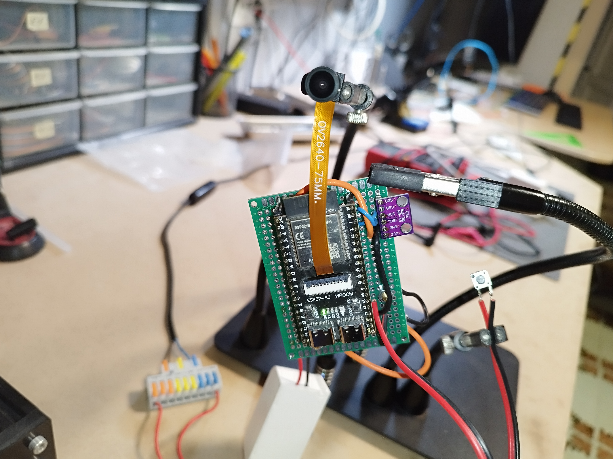

# HASS_doorbell

The project is an integration for ESP32-based and cheap camera modules with Home Assistant. It utilizes a camera API to capture images or stream video. 
On the button press, it sends a notification to Home Assistant that triggers automation.
BME280 temperature/humidity/pressure sensore was also implemented since I had few of them laying around and to 
test HASS autodiscovery capabilities


 

## Features

- Supports various camera models such as OV2640, OV5640, and ESP-EYE.
- Live video streaming and image capture capabilities.
- Customizable camera settings including quality, brightness, and special effects.
- Asynchronous streaming server for efficient (still questionable) data handling.
- Implemented Home Assistant MQTT auto discovery payload.
- Integration with Home Assistant for smart home automation.

## Getting Started

### Prerequisites

- cnadler86 MicroPython firmware available [here](https://github.com/cnadler86/micropython-camera-API/releases/tag/v0.3.0)
- ESP32 (I use ESP32S3 WROOM board from Aliexpress)
- Camera module compatible with ESP32 (I use OV2640)
- Thonny Micropython IDE (or any other MicroPython IDE as you wish... or none at all)
- Running Home Assistant instance with [MJPEG IP Camera](https://www.home-assistant.io/integrations/mjpeg) and [MQTT](https://www.home-assistant.io/integrations/mqtt/) integrations
- esptool
- rshell (https://github.com/jborean93/rshell)

### ESP32 setting up

#### Installing MicroPython firmware

Download the custom Micropython firmware zip provided in the link above, ESP32_GENERIC_S3 in my case. 
After extracting zip 

#### Copying the code

```
rshell --port /dev/ttyACM0 cp -r bme280_if.py boot.py CameraSettings.html config.py connect.py main.py stream_server.py /pyboard/
```


### Home Assistant setting 

Its assumed that that Home Assistant is already installed and running.

#### Installing Motioneye

Motioneye open source solution that offers a practicall way to manage multiple cameras in your setup.
It provides you with a intuitive frontend and motion daemon that will notify you when motion is detected.

```
docker pull ccrisan/motioneye
docker run --name="motioneye"     -p 8765:8765 -p 8081:8081 -p 8082:8082  --hostname="motioneye"     -v /etc/localtime:/etc/localtime:ro     -v /etc/motioneye:/etc/motioneye     -v /var/lib/motioneye:/var/lib/motioneye  -v /dev/:/dev/     --restart="always"     --detach=true     ccrisan/motioneye:master-armhf
```

You can now access Motioneye at http://localhost:8765.

#### Installing MQTT broker

You can run your MQTT broker using Docker container:

```
docker run -it -p 1883:1883 --name mosquitto -v path_to_local_config:/mosquitto/config -v path_to_local_data:/mosquitto/data -v path_to_local_log:/mosquitto/log eclipse-mosquitto
```

In Home Assistant install MQTT integration and set up the MQTT broker.

#### Home Assistant automation

In Home Assistant, create a new automation with the following configuration:

```
alias: doorbell
description: ""
triggers:
  - domain: mqtt
    device_id: 54571e26ccdab3cd25978897039832c3
    type: button_short_press
    subtype: button_1
    trigger: device
conditions: []
actions:
  - parallel:
      - action: notify.mobile_app_pocoloco
        metadata: {}
        data:
          message: anybody home ?
          title: Ding dong
      - action: notify.persistent_notification
        metadata: {}
        data:
          message: anybody home ?
          title: ding dong
mode: single

```

When button is pressed MQTT packet is sent and Home Assistant will trigger automation, 
which will send a notification to your mobile phone.

## Contributing

Contributions are welcome! Please open an issue or submit a pull request on the project's GitHub repository.

## License

This project is licensed under the MIT License - see the [LICENSE](LICENSE) file for details.

## Acknowledgments

- Thanks to the Micropython founders and community for their product and contributions.
- Special thanks to [Christopher Nadler](https://github.com/cnadler86) for providing [micropython-camera-API](https://github.com/cnadler86/micropython-camera-API) to the public.
  
